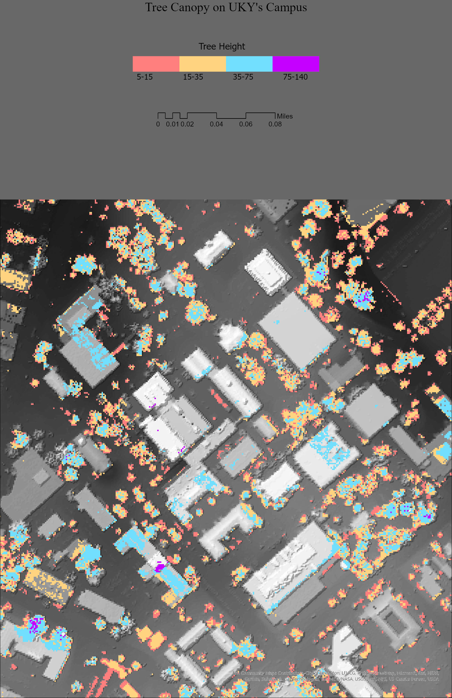

# GEO409 Field Trip Maps
All data comes from the NLCD and the database provided in class

Maps for field trip to measure tree canopy

   
Kentucky counties with selected land cover types – [Download geospatial PDF](CountiesofKentucky.pdf)

   
UKy central campus canopy model – [Download geospatial PDF](TreeCanopy.pdf)

Maps created by Crkr226 for GEO409, Spring 2023, University of Kentucky Department of Geography
